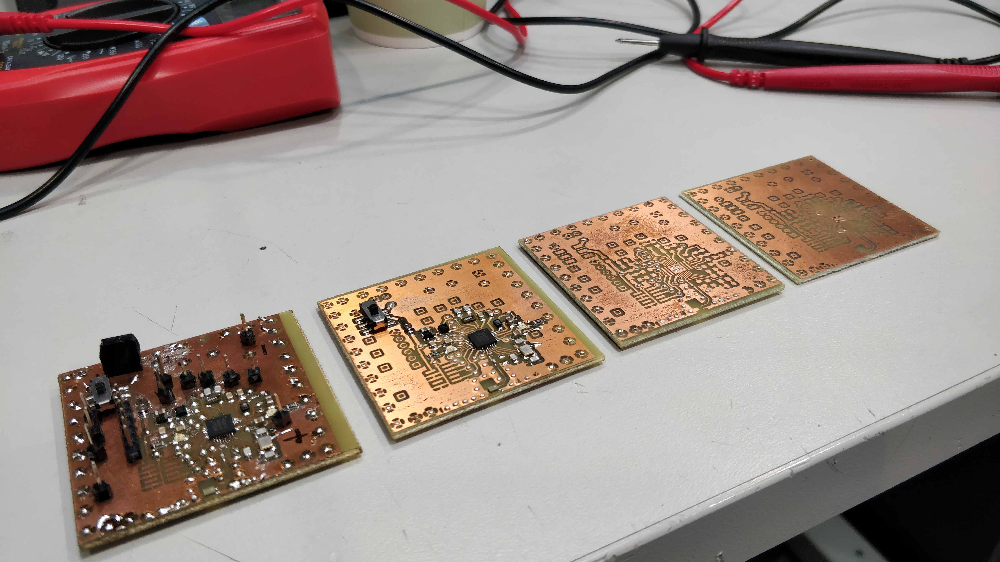
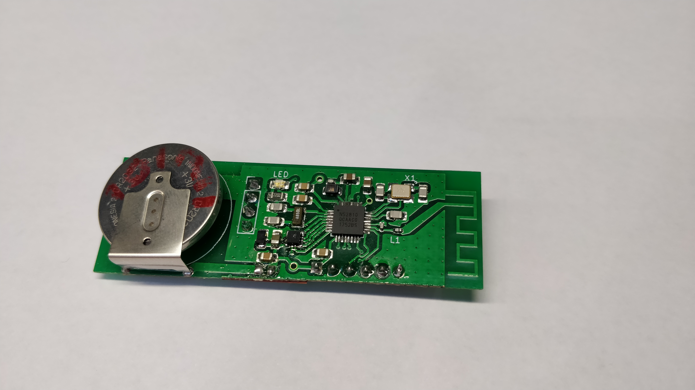
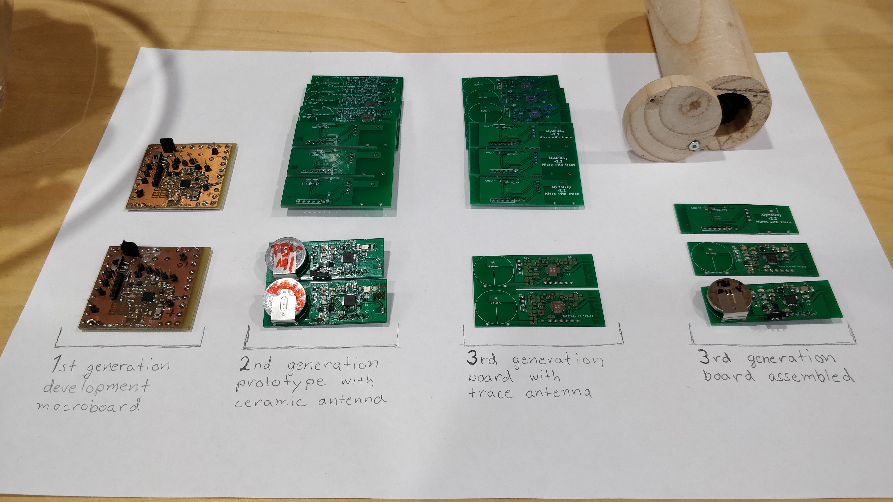
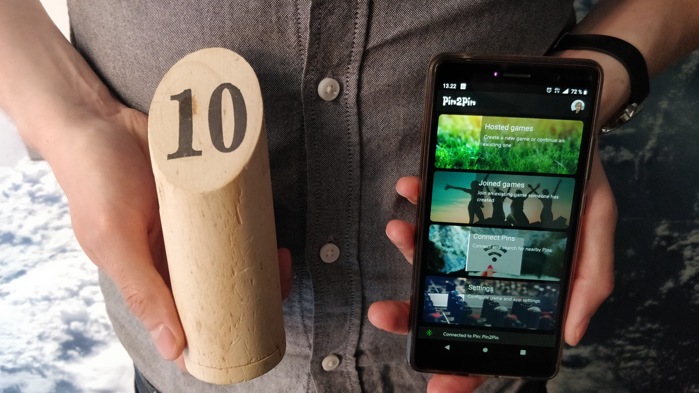

# Project work pcb design

This repository contains the KiCAD schematic and pcb layout files used in Project work course. The designed boards were used in conjunction with developed mobile app to automate a popular finnish outdoor game, Mölkky.

Both macro- and microboard-versions of the design were manufactured, components were soldered in, and the proper functioning of the whole product was both verified and demonstrated.

